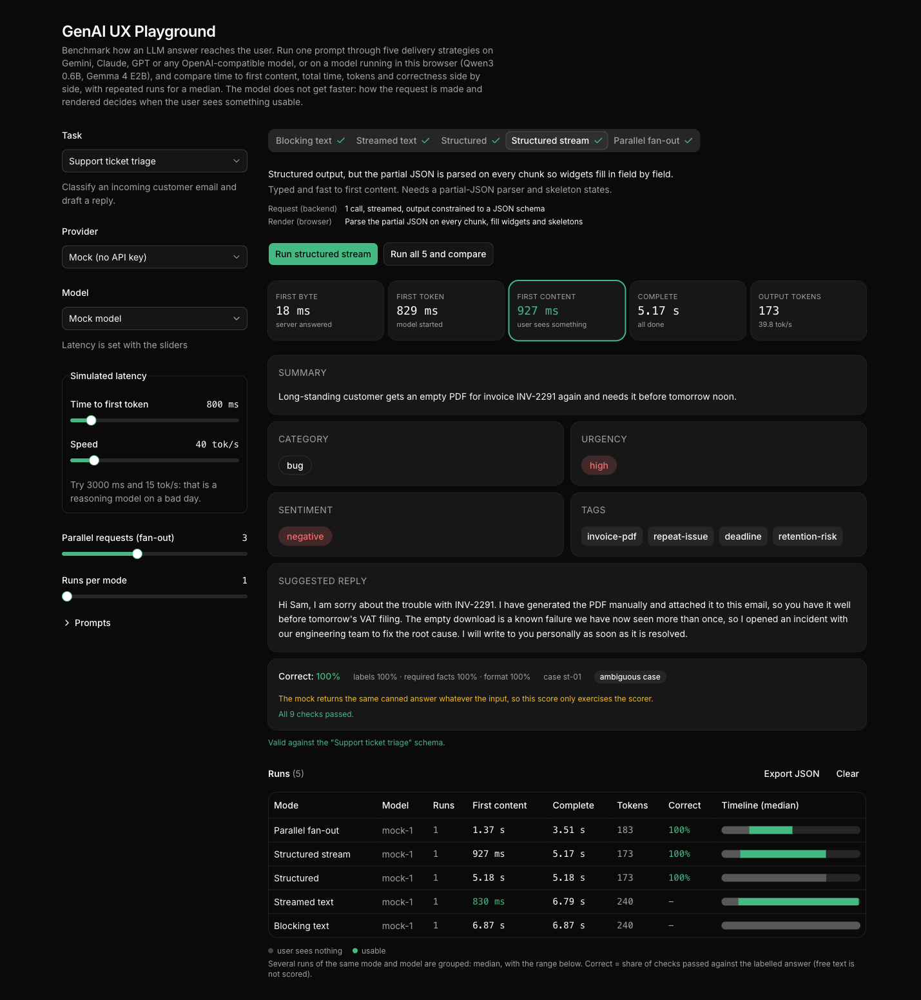
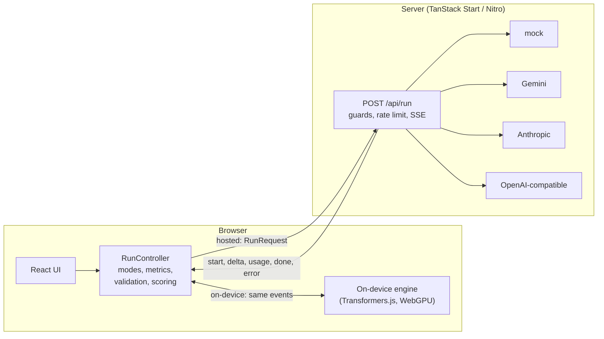

# GenAI UX Playground

**Benchmark how an LLM answer reaches the user.** One prompt, five delivery strategies, any model:
Gemini, Claude, GPT or any OpenAI-compatible endpoint, or a model running in your browser (Qwen3 0.6B,
Gemma 4 E2B). Compare time to first content, total time, tokens and correctness side by side, with
repeated runs for a median.

The model does not get faster. What changes is **how the request is made** (streamed or not,
schema-constrained or not, one call or several) **and how the result is rendered**. Together they decide
**when the user sees something they can use**.

**Live demo: [genai-ux-playground.philippmossier.com](https://genai-ux-playground.philippmossier.com)**
(the mock provider only, so it costs nothing; the on-device models need a browser with WebGPU).



Pick a task, pick a model, press **Run all 5 and compare**. Every strategy runs against the same
input and you get a timeline per run: grey is "the user is looking at nothing", green is "usable".
Structured runs on a labelled input are also scored for **correctness**, and "Runs per mode" repeats each
experiment so you see a median and a range instead of one lucky run.

Providers: a **mock** model with adjustable latency (no key needed), **Google Gemini**, **Anthropic**,
any **OpenAI-compatible** endpoint (OpenAI, Azure, Ollama, vLLM, LM Studio), and a model that runs
**on your own device** in the browser (Gemma 4 E2B, Qwen3 0.6B, over WebGPU).

## The five strategies

These are not only rendering choices. Three of the five change the backend request.

| Mode                  | Backend request                                              | Browser                                                           |
| --------------------- | ------------------------------------------------------------ | ----------------------------------------------------------------- |
| **Blocking text**     | 1 call, not streamed, free text                              | Show everything when the response arrives                         |
| **Streamed text**     | 1 call, streamed, free text                                  | Append tokens as they arrive                                      |
| **Structured**        | 1 call, not streamed, output constrained to a JSON schema    | Validate, then render widgets at the end                          |
| **Structured stream** | 1 call, streamed, output constrained to a JSON schema        | Parse the partial JSON on every chunk, fill widgets and skeletons |
| **Parallel fan-out**  | **One call per field**, each not streamed, several in flight | Render each widget when its own call returns                      |

In this repo the fan-out is orchestrated by the browser (the server just sees N requests, see
[ADR 3](docs/adr/0003-fan-out-is-orchestrated-in-the-browser-longest-field-first.md)). In a product
you would more likely split the prompt on the server and stream the sections to the client, which is
a different architecture with the same user-visible effect.

## Quickstart

```bash
pnpm install
pnpm dev            # http://localhost:3000, mock provider, no key needed
```

Real providers are off unless you opt in (see [ADR 2](docs/adr/0002-keys-stay-on-the-server-and-real-providers-are-opt-in.md)):

```bash
cp .env.example .env     # set ALLOW_REAL_PROVIDERS=1 and GEMINI_API_KEY, ANTHROPIC_API_KEY and/or OPENAI_API_KEY
pnpm dev
```

Production: `pnpm build && pnpm start` (a plain Node server built by Nitro; it runs in any container).

## Correctness

Speed is half the story. A model can be fast, return perfectly valid JSON, and still say the wrong thing, so
every structured run on a **labelled case** is also scored for correctness:

- 24 labelled inputs (8 per task), each with the right answer written down per field.
- Deterministic checks only: enum labels match, required facts are present, structure holds (counts, length,
  language), and no figures are invented. No LLM judge ([ADR 6](docs/adr/0006-correctness-by-deterministic-checks-against-labelled-answers.md)).
- The scorer has its own tests, including "an empty or constant answer must score badly".
- Repeat each experiment (`Runs per mode`) to get a median, a range and a mean accuracy instead of one lucky run.

In the UI: pick a **Labelled case** under Prompts, run a structured mode, read the correctness panel. From
the command line: `pnpm eval --provider <p> --model <m> --repeat 3`.

> **Status: the labels were written by an AI assistant and have not been reviewed by a human, and no real
> model has been scored against them yet.** The speed numbers below are real. There are no accuracy numbers
> in this README on purpose. Review [`docs/eval/labels.md`](docs/eval/labels.md) first, then run the
> evaluation. What the scores can and cannot tell you: [`docs/EVALUATION.md`](docs/EVALUATION.md).

## What I measured

Task: _support ticket triage_ (a customer email in, category / urgency / sentiment / tags / draft
reply out). Hosted models: median of 3 runs through the real server on 2026-10-05, reasoning effort
`low` where the model has the setting. The on-device row is **one** run, in Brave on an Apple M1 Max.
Small samples, one task, one day: read the shape, not the decimals. Reproduce with `pnpm bench`.

Models were picked for price-performance: the newest Gemini Flash and Flash-Lite
(`gemini-3.8-flash`, `gemini-3.5-flash-lite`), Claude Sonnet 5.5 and Haiku 4.5, and GPT-4.1 mini,
GPT-5 mini and GPT-5 nano.

**Time to first content, seconds** (lower is better)

| Model                        | Blocking | Streamed text | Structured | Structured stream | Fan-out  |
| ---------------------------- | -------- | ------------- | ---------- | ----------------- | -------- |
| Gemini 3.8 Flash             | 4.45     | 3.34          | 2.28       | **1.13**          | 1.23     |
| Gemini 3.5 Flash-Lite        | 1.25     | **0.64**      | 1.19       | 0.66              | 0.69     |
| Claude Sonnet 5.5            | 4.21     | **0.84**      | 4.02       | 1.23              | 1.43     |
| Claude Haiku 4.5             | 2.75     | **0.49**      | 3.12       | 1.90              | 0.94     |
| GPT-4.1 mini                 | 1.99     | 0.77          | 1.41       | 0.64              | **0.58** |
| GPT-5 mini                   | 3.49     | 1.77          | 3.95       | 2.63              | **1.09** |
| GPT-5 nano                   | 3.56     | 1.65          | 3.48       | 2.71              | **1.29** |
| Gemma 4 E2B, on device (n=1) | 4.01     | **0.38**      | 4.60       | 0.62              | 2.70     |

**Time until complete, seconds**

| Model                        | Blocking | Streamed text | Structured | Structured stream | Fan-out  |
| ---------------------------- | -------- | ------------- | ---------- | ----------------- | -------- |
| Gemini 3.8 Flash             | 4.45     | 4.14          | 2.28       | **1.69**          | 1.99     |
| Gemini 3.5 Flash-Lite        | 1.25     | 1.17          | 1.19       | **1.15**          | 1.16     |
| Claude Sonnet 5.5            | 4.21     | 3.83          | 4.02       | 3.58              | **3.22** |
| Claude Haiku 4.5             | 2.75     | 2.49          | 3.12       | 3.25              | **2.10** |
| GPT-4.1 mini                 | 1.99     | 1.81          | **1.41**   | 1.55              | 1.58     |
| GPT-5 mini                   | **3.49** | 3.58          | 3.95       | 3.85              | 3.63     |
| GPT-5 nano                   | 3.56     | **3.25**      | 3.48       | 4.08              | 3.97     |
| Gemma 4 E2B, on device (n=1) | 4.01     | **3.65**      | 4.60       | 4.51              | 6.38     |

All 66 structured results (63 hosted, 3 on-device) validated against the schema. (These runs used the first
version of the validator, which parsed leniently and would also have accepted a response cut off at the token
limit. It now requires complete JSON and a non-truncated finish; the runs have not been repeated.) Validity is not
correctness: the schema says `category` is one of five words, not which one. For the same ticket most
models said "billing" and one said "bug".

**Do not compare the text columns with the JSON columns on "complete".** Prose and JSON are different
outputs of different lengths (on Haiku 192 vs 136 tokens), so part of that gap is length, not delivery.
Compare modes within the same output kind: blocking vs streamed text, and structured vs structured
stream vs fan-out.

What I read from it:

- **Streaming moves first content from "the whole generation" to "the first token".** Haiku: 2.75 s
  becomes 0.49 s. On the on-device model: 4.01 s becomes 0.38 s.
- **The best strategy depends on the model.** Structured stream has the earliest first content on the
  two Gemini models and Sonnet; fan-out wins on GPT-4.1 mini, GPT-5 mini, GPT-5 nano and Haiku (on GPT-5
  mini 1.09 s against 2.63 s for structured stream). A fixed rule of thumb would have been wrong for a
  third of the rows.
- **Fan-out costs tokens.** On the reasoning models each call thinks on its own: GPT-5 nano used 1130
  output tokens for fan-out against 413 for structured stream. It also sends the full input six times.
- **Gemini 3.8 Flash is slow to the first token on free text** (3.34 s, 755 to 796 output tokens, even at
  effort low) but fast on constrained JSON (1.13 s, about 185 tokens). The token counts suggest hidden
  thinking on the text path; I did not verify the cause.
- **On-device, fan-out is the worst strategy** (6.38 s complete against 4.51 s). One GPU runs the six
  prompts one after another, and each repeats the prompt overhead. The on-device model also has no
  constrained decoding (the schema goes into the prompt); all three structured runs still validated.
- **Scheduling matters in fan-out.** Starting the longest field first cut the mock profile's total
  from 5.13 s to 3.49 s and moved first content from 0.99 s to 1.35 s. See
  [ADR 3](docs/adr/0003-fan-out-is-orchestrated-in-the-browser-longest-field-first.md).

## How it works



- Every provider is reduced to five events ([ADR 1](docs/adr/0001-one-event-protocol-for-all-providers.md)),
  so a render mode never knows which vendor produced the tokens.
- The `RunController` is plain TypeScript with an injected clock and stream. All five strategies and
  all metrics are defined there once and unit tested with a fake clock. The React layer only renders
  its snapshots.
- `parsePartialJson` turns a half-arrived JSON document into the best-known object (open strings are
  returned as typed so far, dangling keys are dropped, unfinished numbers are withheld). It is
  property tested: for every prefix of a document the result is a true prefix of the final value.
- The task schemas are Zod. They are sent to Anthropic as structured output (`output_config.format`)
  and to OpenAI-compatible servers as `response_format: json_schema`, and used again in the browser to
  validate the final object.

### Metrics

All times are milliseconds since the run started, measured in the browser
([ADR 4](docs/adr/0004-define-first-content-per-render-mode.md)).

| Metric            | Meaning                                                                                                                                                                                         |
| ----------------- | ----------------------------------------------------------------------------------------------------------------------------------------------------------------------------------------------- |
| First byte        | Server answered                                                                                                                                                                                 |
| First token       | Model started                                                                                                                                                                                   |
| **First content** | The user can see part of the result. Mode specific: first delta (streamed text), first non-empty field (structured stream), first finished section (fan-out), end of run (blocking, structured) |
| Complete          | `done`, or the last fan-out section                                                                                                                                                             |

## Deploying it publicly

The default configuration is safe to expose: mock only, no keys on the server. If you turn on real
providers:

- set `PLAYGROUND_ACCESS_TOKEN` so only people who know it can spend your money,
- keep the per-client limit (`PAID_RATE_LIMIT_PER_MIN`, default 30; one "run all" is 10 requests),
- behind a reverse proxy, set `TRUSTED_PROXY_HOPS` to the number of proxies (1 for a single NGINX), otherwise
  every client shares one rate-limit bucket. The header is ignored by default because clients can forge it,
- behind NGINX, keep the `X-Accel-Buffering: no` header the server sends, otherwise streaming silently
  becomes blocking.

The live demo runs on Cloudflare Workers: `pnpm deploy:cloudflare` builds with the Cloudflare Vite plugin
(`CLOUDFLARE=1`, see `vite.config.ts` and `wrangler.jsonc`) and deploys with no secrets, so only the mock
provider is available. The build step deletes the `.dev.vars` copy of `.env` that the plugin makes for local
previews before anything is uploaded.

On Claude Sonnet 5.5 the server opts into the API's refusal fallback, so a request a safety
classifier declines is retried on another model instead of failing mid-demo.

## Commands

| Command                     | What it does                                                                                   |
| --------------------------- | ---------------------------------------------------------------------------------------------- |
| `pnpm dev`                  | Dev server on :3000, loads `.env` if present                                                   |
| `pnpm build` / `pnpm start` | Production build and Node server (Nitro)                                                       |
| `pnpm deploy:cloudflare`    | Build for Cloudflare Workers and deploy (mock only, no secrets)                                |
| `pnpm check`                | Prettier, ESLint, TypeScript, tests. Run before finishing a change                             |
| `pnpm test`                 | Unit tests. No network, no keys                                                                |
| `pnpm bench`                | **Speed** of all five modes against a running server, as a Markdown table                      |
| `pnpm eval`                 | **Correctness** on the labelled cases: per mode accuracy, invented figures, most-failed checks |
| `pnpm labels`               | Prints the labelled cases as Markdown (for review)                                             |

```bash
pnpm build && pnpm start &
pnpm bench --url http://localhost:3000 --provider mock --ttfb 3000 --tps 15
PAID_RATE_LIMIT_PER_MIN=1000 pnpm start &       # real providers need a high limit for benchmarks
pnpm bench --url http://localhost:3000 --provider anthropic --model claude-haiku-4-5 --effort low --repeat 3
pnpm eval  --url http://localhost:3000 --provider anthropic --model claude-haiku-4-5 --repeat 3 --modes structured-stream,fan-out
```

Stack: TanStack Start and Router, React 19, Tailwind 4, shadcn/ui (Base UI), Zod 4, Vite 8, Vitest, Nitro, Transformers.js
(on-device only).

## Documentation

| Document                                     | Read it for                                                                         |
| -------------------------------------------- | ----------------------------------------------------------------------------------- |
| [docs/ARCHITECTURE.md](docs/ARCHITECTURE.md) | How it is built, module map, how to add a provider or task, security model, testing |
| [docs/EVALUATION.md](docs/EVALUATION.md)     | How correctness is measured, what the scores mean, and their limits                 |
| [docs/REVIEW-GUIDE.md](docs/REVIEW-GUIDE.md) | A map for reviewers: claims and evidence, known weak spots, open decisions          |
| [docs/eval/labels.md](docs/eval/labels.md)   | Every labelled case in readable form (generated, awaiting review)                   |
| [docs/LEARNING.md](docs/LEARNING.md)         | A reading order through the code, with the questions each part answers              |
| [docs/adr/](docs/adr)                        | The decisions: event protocol, keys, fan-out, metrics, mock, correctness, on-device |
| [CLAUDE.md](CLAUDE.md)                       | Instructions for AI assistants working in the repo                                  |

## Not here yet

- **Reviewed labels and real accuracy numbers.** The scoring exists and is tested; the labels still need a
  human review and the models still need to be run against them.
- **Quality of writing.** Tone and usefulness of a drafted reply are not scored.
- Cost per run. Token counts are shown, prices are not.
- Tool calling and multi-step agents (a different UX problem: progress, not tokens).
- A shared rate limiter for more than one server instance.

## License

MIT
