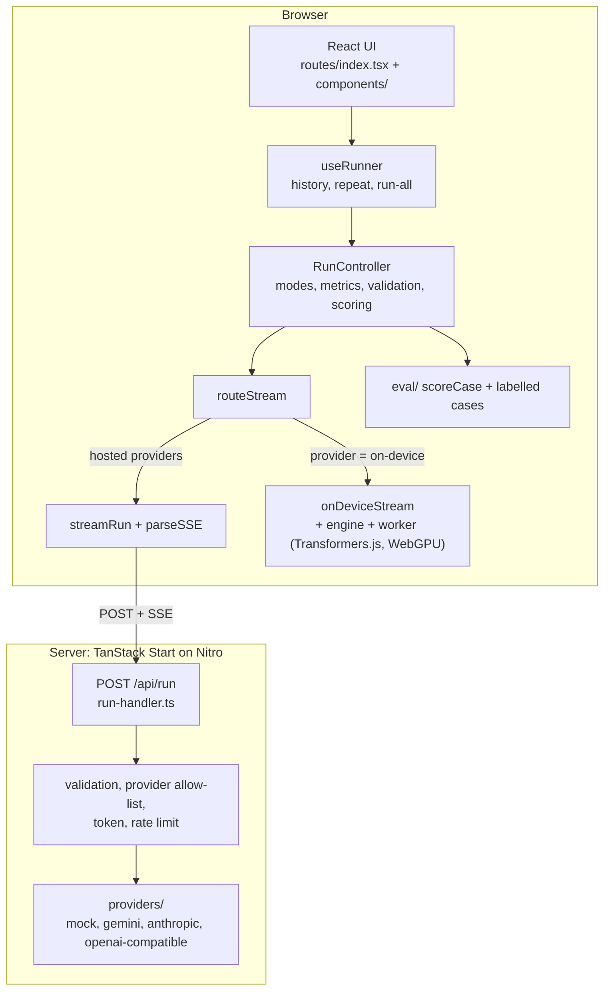

# Architecture

How the playground is put together, where each responsibility lives, and how to extend it.

## The idea in one paragraph

A **run** is one experiment: a task, a model and a delivery mode. A `RunController` (plain TypeScript, in the
browser) executes it by calling a **stream function**: given a request, it yields a small, fixed set of
events (`start`, `delta`, `usage`, `done`, `error`). Hosted models are reached through the server, which
translates each vendor's API into those events. The on-device model produces the same events inside the
browser. The controller turns the events into a live snapshot (text, partial object, sections, metrics, score)
and the React layer only renders that snapshot. Because everything is expressed in the same events, a delivery
mode and the metrics never know which vendor or runtime produced the tokens.



## Life of a request

1. The user presses Run. `useRunner` builds one `RunConfig` per mode and runs them one after another
   (never in parallel, so they do not compete for the same API or GPU), `repeat` times.
2. `RunController.run(config)` picks the strategy from `config.mode` ([`run-controller.ts`](../src/lib/client/run-controller.ts)):
   - blocking / structured: one request with `stream: false`,
   - streamed text / structured stream: one request with `stream: true`,
   - fan-out: one non-streamed request per field, through a small worker pool, longest field first.
3. Requests go through `routeStream`. A hosted provider becomes `POST /api/run`. `on-device` is run locally.
4. On the server, [`run-handler.ts`](../src/lib/server/run-handler.ts) validates the body with Zod, checks that the
   provider is available and the model is on its list, checks the access token (paid providers only, if
   configured), applies the rate limit, builds the system prompt for the format, and streams events back as SSE.
5. The controller folds each event into the snapshot and timestamps it. At `done` it validates the whole
   object with the task schema and, for an unedited labelled input, scores it.
6. The UI renders `snapshot` (live) or the latest finished run of the selected mode.

Pre-flight problems (bad input, not allowed, rate limited) are plain HTTP errors. Once streaming has begun,
problems arrive as an `error` event, because the status line has already been sent.

## The event protocol

Defined in [`src/lib/protocol.ts`](../src/lib/protocol.ts). Rationale: [ADR 1](adr/0001-one-event-protocol-for-all-providers.md).

```ts
type ServerEvent =
  | { type: "start"; provider; model }
  | { type: "delta"; text } // a piece of generated text
  | { type: "usage"; inputTokens; outputTokens }
  | { type: "done"; finishReason }
  | { type: "error"; message };
```

For `stream: false` the server holds every event back until the provider finished, so the browser hears nothing
until the end. That models a classic request/response API honestly: first byte equals complete.

## Module map

| Path                                            | Responsibility                                                                                                     |
| ----------------------------------------------- | ------------------------------------------------------------------------------------------------------------------ |
| `src/routes/index.tsx`                          | The single page: layout, URL search params (task, mode, provider, model), wiring                                   |
| `src/routes/api/run.ts`                         | The one API route; delegates to `run-handler`                                                                      |
| `src/components/`                               | Presentational components: settings, mode result views, metrics, compare table, correctness panel, on-device panel |
| `src/lib/protocol.ts`                           | Request schema, event type, provider and mode ids. Shared by server and client                                     |
| `src/lib/modes.ts`                              | Mode names, descriptions, and what each changes in the request and in the render                                   |
| `src/lib/tasks/`                                | Task definitions: system prompt, default input, Zod schema, field specs for rendering, mock output                 |
| `src/lib/client/run-controller.ts`              | **The core.** All five strategies and all metrics. No React, injected clock and stream                             |
| `src/lib/client/use-runner.ts`                  | React glue: history, repeat, run-all, cancel                                                                       |
| `src/lib/client/aggregate.ts`                   | Groups repeated runs into median, range, mean accuracy                                                             |
| `src/lib/client/stream-run.ts`, `sse-parser.ts` | `fetch` to `/api/run` and the SSE decoder                                                                          |
| `src/lib/client/route-stream.ts`                | Chooses server or on-device by `payload.provider`                                                                  |
| `src/lib/client/export.ts`                      | JSON export, leaving out tokens, prompts and input text                                                            |
| `src/lib/partial-json.ts`                       | Parser for half-arrived JSON (progressive rendering)                                                               |
| `src/lib/eval/`                                 | Labelled cases, deterministic scorer, score summary                                                                |
| `src/lib/providers/`                            | One adapter per vendor, plus the mock                                                                              |
| `src/lib/server/`                               | Handler, rate limiter, env parsing, SSE helpers, server function for the provider list                             |
| `src/lib/on-device/`                            | In-browser engine: worker (Transformers.js), client, model list, event adapter                                     |
| `scripts/`                                      | `bench.ts` (speed), `eval.ts` (correctness), `print-labels.ts`, `copy-ort.mjs`                                     |
| `docs/`                                         | This file, EVALUATION, REVIEW-GUIDE, ADRs, generated label review file                                             |

## Metrics

Defined once, in the controller ([ADR 4](adr/0004-define-first-content-per-render-mode.md)). Timestamps are taken in
the browser, so they include the network and the server hop. "First content" is mode specific because it is the
moment the user can see part of the result.

## Providers

Each provider implements `Provider` ([`providers/types.ts`](../src/lib/providers/types.ts)): `configured()`, `paid`,
`supportsEffort`, `models()`, and `run()`, an async generator of `delta`, `usage`, `done` that throws on errors.

| Provider          | Structured output                                                                       | Notes                                                                                  |
| ----------------- | --------------------------------------------------------------------------------------- | -------------------------------------------------------------------------------------- |
| mock              | Canned, schema-valid output with a configurable latency profile                         | Default. Needs no key. Ignores the input                                               |
| Gemini            | `responseMimeType` + `responseJsonSchema`; effort mapped to `thinkingLevel`             | Output tokens include hidden thinking tokens                                           |
| Anthropic         | `output_config.format` with the Zod schema; effort for models that support it           | Refusal fallback enabled on Sonnet 5.5. Uses the beta messages client                  |
| OpenAI-compatible | `response_format: json_schema`, strict                                                  | Works with any compatible server. Reasoning models get extra completion-token headroom |
| on-device         | None. The schema is written into the prompt and the output is only validated afterwards | Runs in the browser, see below                                                         |

**Adding a provider:** write `providers/<name>.ts` exporting a factory that returns a `Provider`; add its id to
`PROVIDER_IDS` in `protocol.ts`; register it in `providers/index.ts`; add its key to `server/env.ts` and
`.env.example`. Add a test with a fake in `run-handler.test.ts` style. Type-check will tell you the rest.

## Tasks

A `Task` ([`tasks/types.ts`](../src/lib/tasks/types.ts)) has a system prompt, a default input, a Zod object
schema, `fields` (how to render each key: text, long text, badge, list) and `mock` (prose for text modes, data
for JSON modes). A test asserts that the mock data satisfies the schema and that `fields` match the schema keys.

**Adding a task:** create `tasks/<name>.ts`, add it to `TASKS` in `tasks/index.ts`, write 8 labelled cases in
`eval/` (first case = the default input) and regenerate `docs/eval/labels.md`. Keep schemas to enums, strings and
arrays of strings: the Anthropic structured output endpoint does not support every JSON Schema keyword.

## The on-device provider

`src/lib/on-device/`. A worker loads a model through Transformers.js (ONNX Runtime Web, WebGPU) and generates with
a streamer. `engine.ts` is the main-thread handle with a status store (`idle`, `loading`, `ready`, `error`) that
the UI subscribes to. `stream.ts` adapts it to a `StreamFn`, so the controller treats it like any provider.
Differences, all deliberate:

- No network: first byte is about 0.
- No constrained decoding: the schema is appended to the system prompt, and JSON requests use greedy decoding.
  Validity is therefore a real measurement for this provider.
- One GPU: requests are serialised in the engine, so fan-out runs its calls one after another.
- The model is loaded explicitly first (a button), so download time is not billed to a measured run.

The WebAssembly runtime is copied into `public/ort/` by `scripts/copy-ort.mjs` so it is served from this origin.
The 64-bit (JSPI) build is used where available, because the 32-bit one cannot parse single model files over
about 1 GB.

## Security model

- API keys exist only in the server process environment and are never sent to the browser or returned by any
  endpoint (`getProviders` returns names and model ids only).
- Real providers are unavailable unless `ALLOW_REAL_PROVIDERS=1` **and** a key is set. The default deployment is
  mock-only. With `PLAYGROUND_ACCESS_TOKEN` set, paid providers also require the token in `x-playground-token`.
- Per-client rate limit for paid providers (default 30 requests per minute, in memory). The client is the socket
  address, or with `TRUSTED_PROXY_HOPS=N` the N-th `X-Forwarded-For` entry from the right (the one the outermost
  trusted proxy appended; entries further left are client-controlled). The limit is checked before the access
  token, so tokens cannot be guessed at full speed. One "run all" is 10 requests, and one fan-out run is 6.
- Request bodies are validated and capped (input 20 000 characters, `maxTokens` at most 4096). The model must be
  one the provider advertises.
- The JSON export leaves out tokens, system prompts and input text.
- There is no Content-Security-Policy in this app. The on-device provider fetches model files from Hugging Face
  at runtime from the page's origin. (The sister project `local-ai-chat` is the one with a strict CSP.)

## Testing

| Layer                                                  | How                                                                            | Where                        |
| ------------------------------------------------------ | ------------------------------------------------------------------------------ | ---------------------------- |
| Pure logic (parser, scorer, aggregation, rate limiter) | Unit and property tests                                                        | `*.test.ts` next to the code |
| Controller                                             | Fake clock and scripted event streams; every metric definition has a test      | `run-controller.test.ts`     |
| Server handler                                         | Fake providers; asserts status codes, headers, token, rate limit, error events | `run-handler.test.ts`        |
| Mock provider                                          | Real timers at small scales; abort                                             | `mock.test.ts`               |
| Labels                                                 | Checked against the task schemas                                               | `eval/score.test.ts`         |
| Real providers, UI components, on-device engine        | **Not unit tested.** Verified by running them (see REVIEW-GUIDE)               |                              |

`pnpm check` runs format, lint, types and tests. CI runs types, lint, tests and build.

## Conventions

- TypeScript strict, `noUncheckedIndexedAccess`. Zod 4. Prettier (90 columns, organize-imports plugin).
- Server code does not import from `components/`, and `lib/client` does not import the server SDKs. Provider SDKs
  are imported only under `lib/providers/`.
- No em dashes in prose or comments (project style).
- Numbers in the README come from `pnpm bench` or `pnpm eval` runs and are dated. Do not edit them by hand.

## Known sharp edges

See [REVIEW-GUIDE.md](REVIEW-GUIDE.md) for the full list. The ones that bite first: the on-device model needs
WebGPU (use Chromium); `PAID_RATE_LIMIT_PER_MIN` must be raised for the benchmarks; the labelled-case match is an
exact string comparison, so any edit to the input removes the correctness score.
